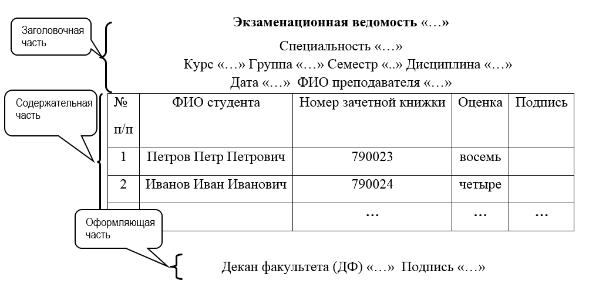
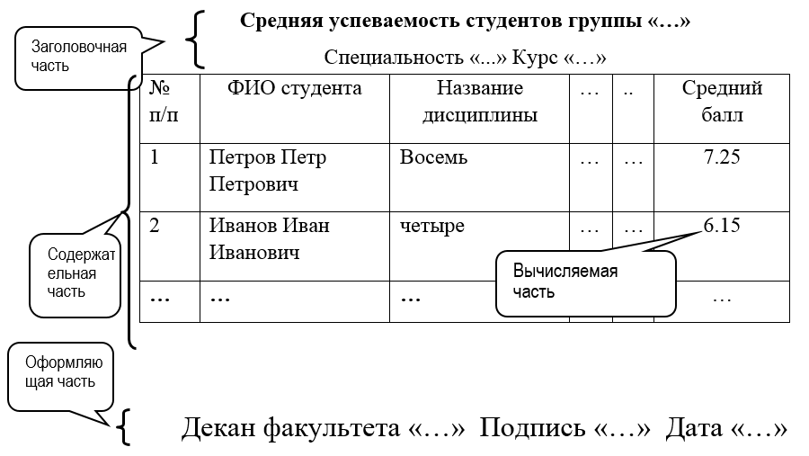
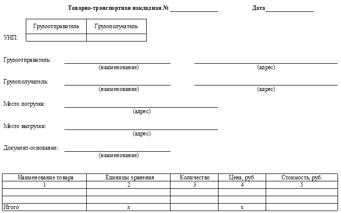

# Лабораторная работа №1 #

## Тема ##

Разработка макетов документов для АС.

## Цель работы ##

Приобрести навыки разработки макетов документов для использования их при проектировании автоматизированной системы и проверки ее функционирования.

## Теоретический материал ##

Макет документа $-$ это графическое представление структуры документа. Макет унифицированного документа состоит из трех частей как показано на Рис.1:

**Рис. 1 – Макет унифицированного документа**

**Заголовочная часть** отражает информацию, как правило, общую для всего документа в целом:
+ наименование и реквизиты организации и/или подразделения, издавшей документ
+ наименование документа
+ дата
+ номер (индекс, код по общегосударственному классификатору управленческой документации $-$ ОКУД) 
+ данные лиц, участвующих в операции, фиксируемой документом
+ прочие характеристики

**Содержательная часть** строится в виде таблицы, состоящей из строк и граф, где располагаются списочные данные с их количественно-суммовыми основаниями, которые обычно размещены в правой части таблицы.

**Оформляющая часть** содержит подписи должностных лиц, отвечающих за правильность его составления, а также дату заполнения документа

Для разработки макетов документов в лабораторной работе рекомендуется использовать примеры, представленные на Рис. 2.

### Макет справочного документа ###

Справочные документы предназначены для хранения постоянной или условно-постоянной информации. К этим документам относятся различного рода справочники, нормы, тарифы, расписания, маршруты и т.д. Данные, заносимые в оперативные документы, сохраняются в базе данных АС (как правило, с помощью команд INSERT и UPDATE).

**Рис. 2 – Структура макета справочного документа «Список студентов группы»**

### Макет оперативного документа ###

Оперативные документы предназначены для фиксации процессов, событий, которые проходят во время функционирования объекта автоматизации. Заголовочная часть, как правило, берется из справочных документов и описывает сам объект, а содержательная часть представляет результаты определенной деятельности. Данные, заносимые в оперативные документы, сохраняются в базе данных АС (как  правило, с помощью команд INSERT и UPDATE). На рис.3 представлен макет оперативного документа «Экзаменационная ведомость», с помощью которого фиксируются результаты сдачи экзаменов студентами.

**Рис. 3 – Структура макета оперативного документа «Экзаменационная ведомость»**

### Макет отчетного документа ###

Отчетные документы предназначены для отображения консолидированной информации, накопленной в БД за счет ввода справочных и оперативных документов. Отчетные документы являются результатом обработки данных, полученных с помощью SELECT -запросов к БД, алгоритмами, формирующими данный (отчетный) документ. На рис.4 представлен макет отчетного документа «Средняя успеваемость студентов».

**Рис. 4 – Пример макета отчетного документа «Средняя успеваемость студентов группы ... за год»**

### ПРИМЕРЫ МАКЕТОВ ДОКУМЕНТОВ ###

Приведенные макеты представляют собой концептуальные модели документов, содержание которых определяется использующих их задачами. Большинство макетов является существенным упрощением реальных документов. При необходимости разработчик может добавлять и удалять поля в макетах документов.

**Справочник специалистов**

| Учетный номер(УчНом) | ФИО специалиста(ФИОспец)| Квалификация(КВАЛИФ)| Дата рождения(ДатаРожд)|
|:----------:|:----------:|:-------------:|:-------------:|
| ... | ... | ...|... |

Начальник отдела кадров «…»

**Справочник тарифов видов работ**

| №п/п| Код работы(КодРаб)| Название работы(НазвРаб)|Стоимость(СтоимРаб)|Время выполнения(ВремВып)| Другие|
|:----------:|:----------:|:-------------:|:-------------:|:-------------:|:-------------:|
| ... | ... | ...|... | ...| ...|

Главный инженер «…»

**Справочник студентов**

|№п/п | Номер зачетной книжки(НомЗачКн)|ФИО студент(ФИОстуд)|Адрес(Адр)| Дата рождения(ДатаРожд)|
|:----------:|:----------:|:-------------:|:-------------:|:-------------:|
| ... | ... | ...|... |... |

Декан факультета «…»

**Оперативный документ «Товарно-транспортная накладная (ТТН)**

**Оперативный документ «Экзаменационная ведомость…»**

**Специальность (Спец) «…»      Курс (Курс)            «…»     Группа (Групп) «…»**
**Семестр (Сем) «..» Дисциплина (Дисц) «…»    Дата (ДатВыд)«…»  ФИО преподавателя (ФИОпреп) «…»**

|№п/п | ФИО студента(ФИОстуд)|Номер зачетной книжк(НомЗачКн)|Оценка(Оц)| Подпись|
|:----------:|:----------:|:-------------:|:-------------:|:-------------:|
| ... | ... | ...|... |... |

**Декан факультета  (ФИОдек) «….»  Подпись   «….»  Дата  (ДатаПодп)   «…»**

## Ход работы ##

1. Разработать макеты для справочных, оперативных и отчетных документов, указанных в **Приложении 1** бланка задания курсовой работы.
2. Документировать результаты выполнения лабораторной работы.

## Контрольные вопросы ##

1. Что такое макет документа и в каких целях он применяется?
2. Какова структура унифицированного документа?
3. Какие данные указываются в заголовочной части?
4. Какие данные указываются в содержательной части?
5. Какие данные указываются в оформительской части?
